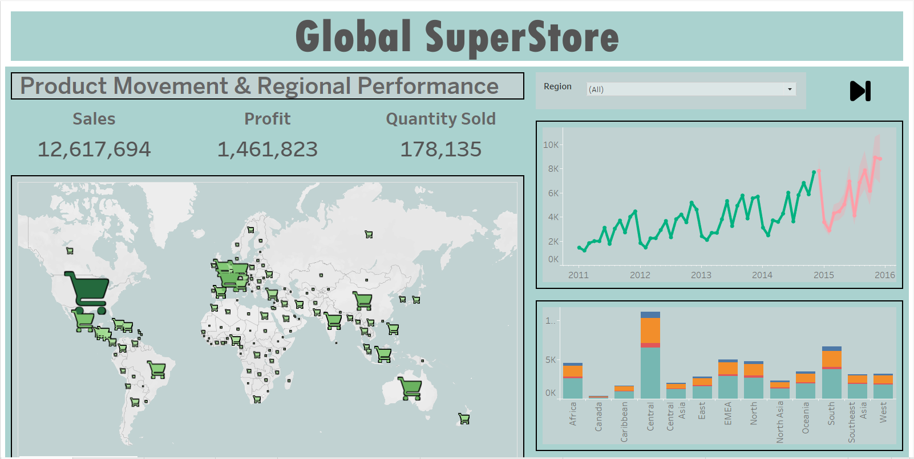
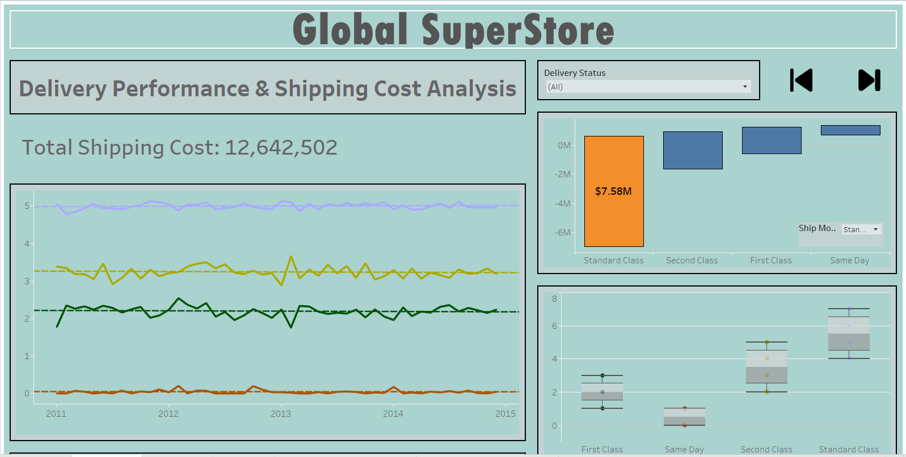

# 📊 Global Superstore – Descriptive Analysis

## 🧾 Overview
This project explores and visualizes sales performance using the **Global Superstore** dataset. The goal was to uncover trends in sales, profits, and customer segments using **Tableau** dashboards.

---

## 💼 Objectives
- Understand sales performance across regions, segments, and product categories
- Identify top-performing markets and product lines
- Visualize patterns to support strategic retail decisions

---

## 📊 Tools & Technologies
- **Tableau** – For interactive visualizations
- **Excel** – Data preparation
- **PowerPoint/PDF** – For summary presentation (if available)

---

## 📈 Key Insights
- Central and West regions dominate in sales but differ in profitability
- Office Supplies perform well overall, especially in B2B segment
- High discounts are often linked to negative profit margins

---

## 📸 Visuals

### Dashboard 1

### Dashboard 2

### Dashboard 2

---

## 📁 Files
- `dashboard_screenshot.png` – Main dashboard view
- `superstore_dashboard.twbx` – Tableau packaged workbook
- `presentation.pdf` – Summary of key insights *(optional)*

---

## ✅ Next Steps
- Build a predictive model on top of sales trends
- Combine this with forecast and customer segmentation analysis

